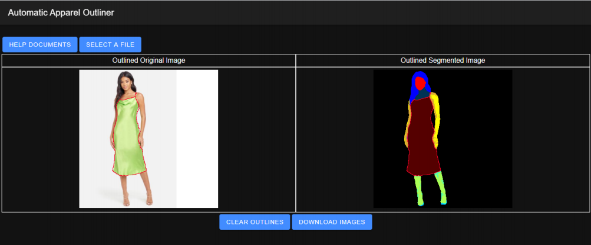

# The Automatic Apparel Outliner Project
 |[Overview](#Overview)|[Installation](#Installation)|[Accessing The App](#Accessing\ The\ App)|[Using The App](#Using\ The\ App)|
 |:---|:---|:---|:---|

## Overview
Automatic Apparel Outliner (AAO) web app is designed to draw outlines around the section of images
containing articles of clothing in photographs. 

This site provides information regarding the AAO project.

## Installation
1. Install Docker
    * Go to https://docs.docker.com/get-docker/ and download Docker for Mac/Windows/Linux 
    * Run the installer exe/bin to install Docker on the machine that will be the server
    * Run Docker app on the 
1. Install [Git](https://git-scm.com/downloads)
1. Clone the AAO repository:
    > $ git clone https://github.com/sloanlipman/automatic-apparel-outliner.git
1. Navigate to the directory containing the file called Dockerfile
1. Run the following command:
    > $ docker build .
1. The above comand will provide a docker image ID.  Use that image ID with the following command:
    > $ docker run \<imageID>

## Accessing The App
Once the docker image is running the app can be accessed through a web browser at the following address:

> http://\<Server IP Address>:12345/home

## Using The App

1. Click the “SELECT A FILE” button and select an image from your device to upload. The supported image file types are JPEG, PNG or BMP.

2. Once image is uploaded to AAO, it will show uploaded image on the left side and
segmented image on the right side. Segmented images have mutiple sections in different
colors detected by image classification algorithm. It allows AAO to distiguish between apparel section(s).

3. AAO allows users to customize the outline color and thickness. You can select any outline
color for the apparel by clicking the box next to “Select an outline color” under the Segmented
Image section. The default outline color is white.
Click on the box below the Segmented Image area to bring up the color selector.

4. To selecte the outline thickness click on the box below the outline color selector.  Availabile line thicknesses are small (one pixel wide), medium (3 pixels wide), and Large (5 pixels wide).

5. Select the region that corresponds to the to the desired type of apparel on the Segmented Image.  Once clicked the selected color will show in the box bellow the outline thickness selector.

6. Clicki on the "Outline Selected Segment" button at the bottom of the screen to generate the outlines.

